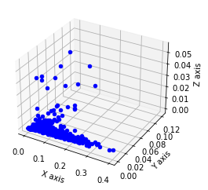

## COVID-19 RADIOGRAPHY BASED CLASSIFICATION USING MULTIPROTOTYPE FUZZY LOGIC

---

#### Batch 1 Grp 2 EDI :

- 12011104 - Tanmay Mutalik
- 12011328 - Vishal Govindani
- 12011078 - Kuhu Mukhopadhyay
- 12011385 - Amey Chopde

---

## About the Dataset:

#### COVID-19 CHEST X-RAY DATABASE:

A team of researchers from Qatar University, Doha, Qatar, and the University of Dhaka, Bangladesh along with their collaborators from Pakistan and Malaysia in collaboration with medical doctors have created a database of chest X-ray images for COVID-19 positive cases along with Normal and Viral Pneumonia images. This COVID-19, normal and other lung infection dataset is released in stages. In the first release we have released 219 COVID-19, 1341 normal and 1345 viral pneumonia chest X-ray (CXR) images. In the first update, we have increased the COVID-19 class to 1200 CXR images. In the 2nd update, we have increased the database to 3616 COVID-19 positive cases along with 10,192 Normal, 6012 Lung Opacity (Non-COVID lung infection) and 1345 Viral Pneumonia images and corresponding lung masks. We will continue to update this database as soon as we have new x-ray images for COVID-19 pneumonia patients.

##### Formats

        - All the images are in Portable Network Graphics (PNG) file format and resolution are 299*299 pixels.

##### Objective

       -  Researchers can use this database to produce useful and impactful scholarly work on COVID-19, which can help in tackling this pandemic.

##### COVID-19 data:

> COVID data are collected from different publicly accessible dataset, online sources and published papers.
>
> - 2473 CXR images are collected from padchest dataset[1].
> - 183 CXR images from a Germany medical school[2].
> - 559 CXR image from SIRM, Github, Kaggle & Tweeter[3,4,5,6]
> - 400 CXR images from another Github source[7].

##### Normal images:

> 10192 Normal data are collected from from three different dataset.
>
> - 8851 RSNA [8]
> - 1341 Kaggle [9]

##### Lung opacity images:

> 6012 Lung opacity CXR images are collected from Radiological Society of North America (RSNA) CXR dataset [8]

##### Viral Pneumonia images:bo

> 1345 Viral Pneumonia data are collected from the Chest X-Ray Images (pneumonia) database [9]

##### Dataset Link:

[COVID-19 Chest X-Ray Database](https://www.kaggle.com/datasets/tawsifurrahman/covid19-radiography-database)

##### Dataset Reference:

[1]https://bimcv.cipf.es/bimcv-projects/bimcv-covid19/#1590858128006-9e640421-6711

[2]https://github.com/ml-workgroup/covid-19-image-repository/tree/master/png

[3]https://sirm.org/category/senza-categoria/covid-19/

[4]https://eurorad.org

[5]https://github.com/ieee8023/covid-chestxray-dataset

[6]https://figshare.com/articles/COVID-19_Chest_X-Ray_Image_Repository/12580328

[7]https://github.com/armiro/COVID-CXNet

[8]https://www.kaggle.com/c/rsna-pneumonia-detection-challenge/data

[9] https://www.kaggle.com/paultimothymooney/chest-xray-pneumonia

## <!-- horizontal line -->

## About the Project:

#### Problem Statement:

> To classify the chest X-ray images of COVID-19 patients into COVID-19 , Viral Pneumonia and Normal classes using the Multi-Prototype Fuzzy Logic algorithm.

#### Dataset Statistics:

**Number of images in each class:**

<!-- - COVID-19: &nbsp;&nbsp;&nbsp;&nbsp;&nbsp;&nbsp;&nbsp;&nbsp;&nbsp;&nbsp;&nbsp; 3616
- Normal:  &nbsp;&nbsp;&nbsp;&nbsp;&nbsp;&nbsp;&nbsp;&nbsp;&nbsp;&nbsp;&nbsp;&nbsp;&nbsp;&nbsp;&nbsp;&nbsp; 10192
- Viral Pneumonia:&nbsp;&nbsp; 1345 -->

|      Class      | Total Images | Train Images | Test Images |
| :-------------: | :----------: | :----------: | :---------: |
|     Normal      |    10192     |     8153     |    2039     |
|    COVID-19     |     3616     |     2892     |     724     |
| Viral Pneumonia |     1345     |     1076     |     269     |

<!-- insert dataset image demo -->

#### Flow chart:

#### Data Preprocessing:

- The dataset was divided into train and test sets in the ratio 80:20.
- The images are sharpened using the standard laplacian mask filter with a kernel size of 3.
- The images are converted to grayscale.
- The images are normalized.
- The images are converted to numpy arrays.
  <!-- display two images in single row -->
  
  

#### Clustering:

    - Clustering the vectors that are within the threshold distance(r) for each class.
    - The distance between the vectors is calculated using the euclidean distance formula.
    - Each cluster represents a prototype vector of the respective class.
    - The prototype vectors are used to classify the test images.

&nbsp;

    - Class Normal:
        - Number of training vectors => 8153
        - For r = 0.025, no. of clusters => 1579

<!-- insert image -->

    - Class COVID-19:
        - Number of vectors => 2893
        - For r = 0.019, no. of clusters => 1597

<!-- insert image -->

    - Class Viral Pneumonia:
        - Number of vectors => 1068
        - For r = 0.015, no. of clusters =>  755

<!-- insert image -->

#### Averaging the clusters:

    - Averaging the clusters to get the prototype vectors for each class.
    - Each average vector represents the prototype vector of the respective class.
    - The prototype vectors are used to classify the test images.

&nbsp;

    - Class Normal:
        - Number of prototypes => 1579

<!-- insert image -->

    - Class COVID-19:
        - Number of prototypes => 1597

<!-- insert image -->

    - Class COVID-19:
        - Number of prototypes => 755

<!-- insert image -->

    - All class prototypes in 2D:

<!-- insert image -->

    - All class prototypes in 3D:

<!-- insert image -->

#### Classification:

    - The test vectors are classified into the respective classes using the prototype vectors.
    - The distance between the test image vector and the prototype vectors is calculated using the euclidean distance formula.
    - Each test vector is assigned a degree of membership with respect to each prototype vector.
    - The degree of membership of the test vector with the prototype vector of the respective class is calculated using the following formula:
    &nbsp;

&nbsp;
&nbsp;

- let x be the test vector
- let y be the prototype vector

$$ \text{Euclidean Distance = } d_{x} = \sqrt{\sum*{i=1}^{n} (x_i - y_i)^2} $$

$$ \mu_{x} = \begin{cases} 0 & \text{if } \gamma*d>1 \\ 1 & \text{if } \gamma*d=0 \\ 1 - \gamma*d & \text{if } 0<\gamma*d<1 \end{cases} $$

$$
\text{where,
} \gamma = \text{ sensitivity parameter}
\\
\text{d} = \text{distance between the test vector and the prototype vector}
$$

<!-- insert image at center-->

&nbsp;
&nbsp;
&nbsp;

#### Results:

    - The accuracy of the model is calculated using the following formula:

&nbsp;

$$\text{Accuracy} = \frac{\text{Number of correctly classified test vectors}}{\text{Total number of test vectors}}*100$$
&nbsp;

    - The accuracy of the model is calculated for each sensitivity parameter.
    - The sensitivity parameter that gives the highest accuracy is selected as the optimal sensitivity parameter.
    - The optimal sensitivity parameter is used to classify the test vectors.
    - The accuracy of the model is 79.81% for the optimal sensitivity parameter 0.1.

&nbsp;

###### The confusion matrix for the model is as follows:

<!-- insert image -->

&nbsp;

<!--
classification report

      precision    recall  f1-score   support

       covid       0.65      0.72      0.68       724
      normal       0.93      0.83      0.88      2039
   pneumonia       0.50      0.75      0.60       269

    accuracy                           0.80      3032
   macro avg       0.69      0.77      0.72      3032
weighted avg       0.82      0.80      0.81      3032
 -->

###### The classification report for the model is as follows:

| Class        | Precision | Recall | F1-Score | Support |
| ------------ | --------- | ------ | -------- | ------- |
| covid        | 0.65      | 0.72   | 0.68     | 724     |
| normal       | 0.93      | 0.83   | 0.88     | 2039    |
| pneumonia    | 0.50      | 0.75   | 0.60     | 269     |
| Accuracy     |           |        | 0.80     | 3032    |
| Macro Avg    | 0.69      | 0.77   | 0.72     | 3032    |
| Weighted Avg | 0.82      | 0.80   | 0.81     | 3032    |

&nbsp;

##### Inference:

- The accuracy of the model is 79.81% for the optimal sensitivity parameter 0.1.
- The model is able to classify the test images with an accuracy of 79.81%.

&nbsp;

$$ \text{for } \gamma = 0.1 $$

| Class           | Total Images | Train Images | Test Images | Threshold (r) | No. of prototypes | Correctly Classified Images | Accuracy |
| --------------- | ------------ | ------------ | ----------- | ------------- | ----------------- | --------------------------- | -------- |
| All Classes     | 15153        | 12121        | 3032        |               | 3931              | 2420                        | 79.81%   |
| Normal          | 10192        | 8153         | 2039        | 0.025         | 1579              | 1700                        | 83.37%   |
| Covid           | 3616         | 2892         | 724         | 0.019         | 1597              | 519                         | 71.68%   |
| Viral Pneumonia | 1345         | 1076         | 269         | 0.015         | 755               | 201                         | 74.72%   |

&nbsp;

##### Future Work:

- The model can be improved by using a larger dataset.
- The model can be improved by reducing the threshold value of clustering
- The time complexity of the model can be reduced.

&nbsp;
